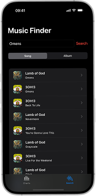

# MusicPlayer

MusicPlayer is an iOS app designed to help you discover, search, and preview top music tracks and albums from around the world. With a clean and intuitive interface, you can explore the latest charts, search for your favorite songs or albums, and listen to previews directly within the app.

## Screenshots

## Features

- **Top Charts:**
  - Browse the top 10 most played songs or albums in various countries, including Germany, USA, Denmark, Spain, Italy, and UAE.
  - Instantly view artist details, track names, and album artwork.

- **Music Search:**
  - Search for songs or albums using the iTunes API.
  - Filter your search results by song or album.
  - View detailed information about each result, including artist, track, and album details.

- **Song Details & Preview:**
  - Dive into detailed views for each song or album.
  - Listen to a preview of the track right from the app.
  - Open the artist or track directly in Apple Music.

- **Modern SwiftUI Design:**
  - Built with SwiftUI for a smooth, modern, and responsive user experience.
  - Dark mode support for comfortable browsing.

## Note

This project is being developed as part of my 1-year training journey to become an app developer. It is a work in progress, and I am continuously learning and improving the app as I grow my skills.
